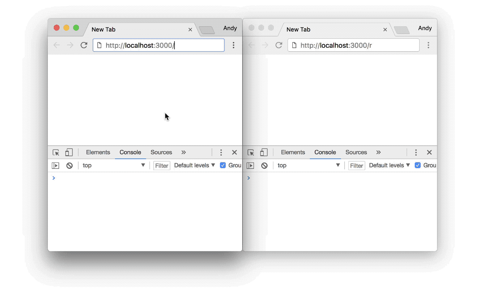

# Socket.io Demo

Socket.io Demo for [my talk](https://www.meetup.com/jstl-meetup/events/246238002/) at the [jSTL meetup](https://www.meetup.com/jstl-meetup/) on March 28, 2018

## Prerequisites
[Node.js](https://nodejs.org/en/download/) (and [npm](https://www.npmjs.com/)).

## Installation
`npm i`

## How to use
1. `npm start`
2. Open `localhost:3000` in a browser for the "screen."
3. Open `localhost:3000/r` in a browser for the "remote."
4. In each window open the javascript console.
5. On the Remote page, click "send" to see "hello screen!" in the Screen page's console log.
6. On the Remote page, click "color!" to change the Screen page's background color.
7. On the Screen page, click "thanks!" to see "[screen id] says thanks" in the Remote page's console log.